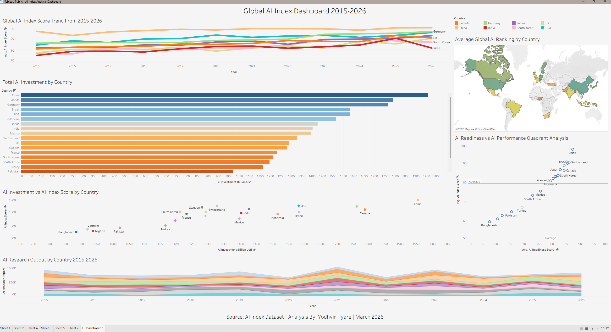

# Global AI Index Analysis (2015–2026)

## Overview
A full-stack data analytics project examining AI adoption, 
investment, and performance trends across 20 different countries 
from 2015 to 2026. This project demonstrates a complete analytics pipeline 
from database design and SQL querying in MySQL, through 
statistical analysis in JMP, and interactive visualization 
in Tableau Public.

**Central Question:** What drives a country's AI 
strength and how has the global AI landscape shifted 
from the years 2015 to 2026?

---

## Tools & Technologies
| Tool | Purpose |
|---|---|
| **MySQL** | Database design, data storage, and 9 analytical queries |
| **JMP** | Descriptive statistics, correlation, and regression analysis |
| **Tableau Public** | 6-chart interactive dashboard and visualization |

---

## Dataset
- **Source:** Kaggle - AI Index Dataset
- **Link:** [kaggle.com/datasets/abidhussai512/global-ai-index-20152026-readiness-and-rankings](https://www.kaggle.com/datasets/abidhussai512/global-ai-index-20152026-readiness-and-rankings)
- **Records:** 240 rows
- **Countries:** 20
- **Years:** 2015–2026
- **Variables:** 27 columns including AI index score, 
  investment, research output, adoption rates, and rankings

---

## SQL Analysis
Nine queries written using a range of techniques:

| File | Description | Techniques Used |
|---|---|---|
| Database Setup 01 | Creates database and table | CREATE, IF NOT EXISTS |
| Avg Score By Country 02 | Country AI score rankings | AVG, GROUP BY, ORDER BY |
| Top 5 Investments 03 | Top investors per year | RANK(), PARTITION BY, Subquery |
| Improvements in Rank 04 | Most improved countries | MIN, MAX, GROUP BY |
| Score Change 05 | Year over year changes | LAG(), Window Functions |
| GDP vs AI Performance 06 | GDP tiers vs AI score | CASE, GROUP BY |
| Peak Year 07 | Best year per country | RANK(), Subquery |
| Underperformers 08 | High spend low score | HAVING, Nested Subqueries |
| AI Readiness vs Score 09 | Readiness vs score gap | Calculated Columns |

---

## Statistical Analysis (JMP)

### Descriptive Statistics
- Global average AI index score: 79.34
- Highest scoring country: China (avg score: 97.19)
- Lowest scoring country: Bangladesh (avg score: 59.59)

### Correlation Analysis
- Strongest correlation with AI index score: AI Readiness Score (r = 0.9025)
- GDP per capita vs AI score: r = 0.8631
- AI readiness vs AI score: r = 0.9025

### Regression Results
- R-squared: 0.1089 — model explains 10.89% of variance in AI index score based on investment alone. AI readiness score ended up showing a much stronger correlation (r = 0.9025), which goes to show that infrastructure is a better predictor than spending on investments alone. 
- Strongest significant predictor: AI Investment in Billions of USD (p < 0.001)

---

## Key Findings
- China and USA consistently hold the top 2 AI index 
  scores across the 12 years analyzed
- AI readiness score is the strongest predictor of 
  overall AI performance — stronger than raw investment itself
- 1 country (Mexico) spends above global average on AI but 
  scores below average — indicating investment inefficiency
- Developing nations show the fastest AI growth rates 
  despite lower absolute index scores

---

## Live Tableau Dashboard
**[Click Here to View Interactive Dashboard](https://public.tableau.com/app/profile/yodhvir.hyare/viz/AIIndexAnalysisDashboard/Dashboard1)**

[](https://public.tableau.com/app/profile/yodhvir.hyare/viz/AIIndexAnalysisDashboard/Dashboard1)

---

## Repository Structure
\```
global-ai-index-analysis/
├── data/                    → Raw dataset from Kaggle (CSV, 240 records)
├── sql_queries/             → 9 SQL analytical queries
├── jmp_outputs/            → JMP statistical output screenshots
├── Tableau/                 → Dashboard screenshots and Workbook
└── README.md                → Project documentation
\```

---

## Author
**Yodhvir Hyare**
- LinkedIn: [linkedin.com/in/yodhvirhyare](https://www.linkedin.com/in/yodhvirhyare)
- Tableau Public: [public.tableau.com/profile/yodhvir.hyare](https://public.tableau.com/app/profile/yodhvir.hyare/vizzes)
- GitHub: [github.com/yodhvir24](https://github.com/yodhvir24)

*Tools: MySQL | JMP | Tableau Public | March 2026*
